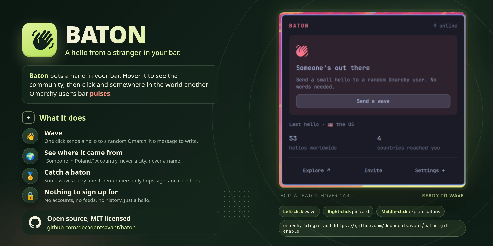

# Baton

**Someone's out there.** Wave at a random Omarchy user, somewhere in the world.



Baton puts a hand in your Omarchy bar. Click it, and somewhere in the world
another Omarchy user's bar pulses:

```text
🇵🇱  Someone in Poland waved at you
```

They can wave back. That is the whole thing. No accounts, no names, no
messages, no feed. Just a small hello from someone who chose the same odd
operating system you did.

## Install

Two commands. Thirty seconds.

```bash
omarchy plugin add https://github.com/decadentsavant/baton.git --enable
omarchy bar put io.github.decadentsavant.baton --section right
```

Prefer the launcher? Press `Super` + `Space`, search for **Add Plugin**, and
paste `https://github.com/decadentsavant/baton`.

Then hover the hand. Left-click waves. Right-click opens
[the batons page](https://relay.baton.buzz). Middle-click opens options.

[Watch the 27-second demo](docs/preview.mp4) if you want to see a wave land
before you install.

## What happens next

- **You wave.** One click. There is nothing to type.
- **A stranger's bar pulses.** They get a notification with your country and
  nothing else. If you would rather not share that, waves arrive as
  "Someone, somewhere".
- **They can wave back.** Or wave at someone else. Either way, a hello went
  around the world for free.
- **Sometimes a wave carries a baton.** If one reaches you, the hand lights up.
  Your next wave passes it on and adds a hop.

```text
412 hops · alive 3 weeks · 23 countries
```

A baton remembers only those three facts. Not who held it, not where it has
been in order. It is a small story with no people in it, and you can share its
page with anyone.

## One wave an hour

A wave you could send every second would be worth nothing. The one you receive
lands because the sender spent their hour on it. A wave into an empty room only
costs a minute, and the widget tells you when that happens, so a click never
silently does nothing.

You cannot be cruel in one bit. There is no field to put an insult in, so Baton
ships without a report button, a block list, or a moderation queue, because
there is nothing to moderate. Replies, reactions, custom text, profiles, and
finding the same stranger twice are not coming. The answer is no, with
affection.

## Share it

A hello is better with someone on the other end. Run:

```bash
omarchy-shell baton invite
```

That copies a short invite to your clipboard, with the story of whatever baton
you are holding. Paste it to a friend who runs Omarchy. Or send them
[relay.baton.buzz](https://relay.baton.buzz), which has a copy button.

---

## Privacy, in short

- **Your identity is a random token** minted locally on first run and stored in
  `~/.local/state/baton/`. It is not an account. Delete the folder and you are
  a different stranger.
- **Waves carry a country, never a city or address.** The relay works it out
  from your connecting address using a public-domain range list, then drops
  it. Turn off *Share my country* and yours arrive as "somewhere".
- **The relay sees your IP while you are connected**, like any server. It
  hashes it with a salt that changes every restart, uses the hash only to cap
  waves per address, and never writes it down.
- **The relay stores aggregates only:** the total wave count and each baton's
  id, birth time, hop count, and country count. Not holders, not who waved at
  whom.
- **Nothing phones home.** The widget talks to the relay and nothing else. No
  telemetry, no analytics. The relay's code is public so you can
  [audit it](https://github.com/decadentsavant/baton-relay).

## Requirements and permissions

Requires Omarchy Quattro with its Quickshell bar and plugin commands. The
widget runs with your user permissions inside the existing shell. It needs no
root access, no install script, no daemon, and no downloaded executable. It
opens one HTTPS connection to `https://relay.baton.buzz` when enabled and sends
nothing until you click.

| Dependency | Purpose |
|---|---|
| `curl` | HTTPS stream and wave requests to the relay. |
| `bash`, coreutils, `sed`, `flock` (util-linux) | Create and read the local random identity under a file lock, and cap what the relay may send. |
| `omarchy-notification-send` | Incoming-wave and clipboard notifications. |
| `xdg-open` (xdg-utils) | Open the batons page on right-click. |
| `wl-copy` (wl-clipboard) | Copy an invite. |
| `canberra-gtk-play` (libcanberra, optional) | Chime when `sound` is enabled. |

## Settings

| Key | Default | Meaning |
|---|---|---|
| `shareRegion` | `true` | Include your country with waves. `false` arrives as "somewhere". |
| `sound` | `false` | Chime on incoming waves. |
| `showCounter` | `true` | Show the global counters in the tooltip. |

The options popup on middle-click sets the first one. From a terminal, booleans
need `--json`:

```bash
omarchy bar set io.github.decadentsavant.baton sound true --json
```

`omarchy-shell baton wave` sends a wave and `omarchy-shell baton invite` copies
an invite, so both can go on a Hyprland keybind. Multiple monitors share one
connection, one cooldown, and one notification.

## Update, disable, remove

```bash
omarchy plugin update io.github.decadentsavant.baton
omarchy plugin disable io.github.decadentsavant.baton
omarchy plugin remove io.github.decadentsavant.baton
```

Omarchy does not update plugins on its own. If the relay ever needs a newer
widget than yours, the tooltip gains an "Update available" line with the
command above, and you get one notification per session.

Removal keeps your identity in `~/.local/state/baton/` so a reinstall is the
same stranger. Delete that folder to start fresh.

## Development

QML and JavaScript, loaded by the existing Omarchy shell. No build step.

```bash
node dev/model-test.js
omarchy plugin validate .
```

[`dev/preview.sh`](dev/preview.sh) runs the real widget against an isolated
local relay and renders the demo video; [`dev/listing.sh`](dev/listing.sh)
renders the preview card. See [the preview guide](docs/PREVIEW.md). The relay
lives in [its own repository](https://github.com/decadentsavant/baton-relay).

MIT licensed. See [LICENSE](LICENSE).
